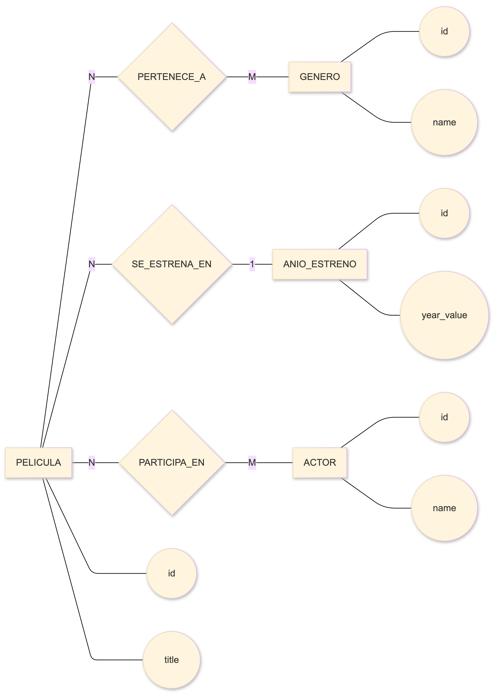
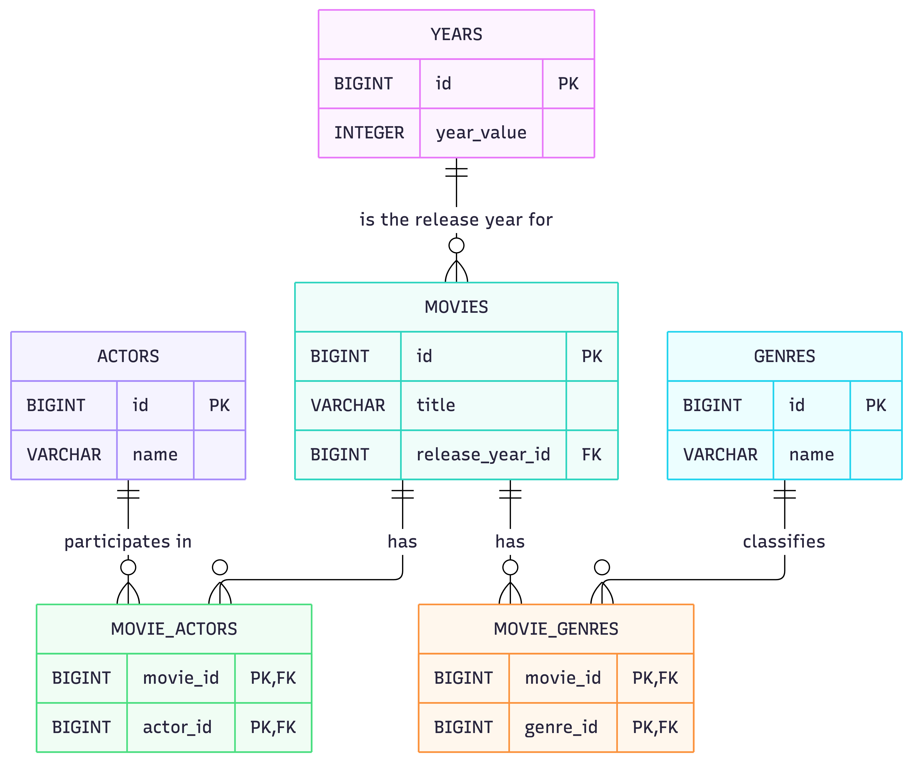
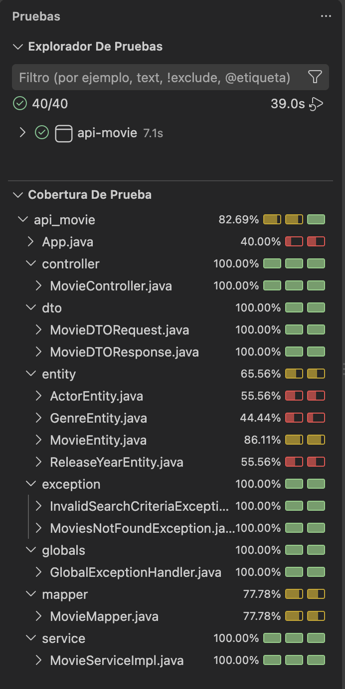

# Movie API

API REST para gestionar un catálogo de películas. El proyecto permite crear, consultar, actualizar y eliminar películas, además de buscarlas por título o género.

La aplicación fue desarrollada con Spring Boot como proyecto formativo de la Digital Academy de Factoría F5. Su estructura separa las responsabilidades entre controladores, servicios, repositorios, entidades, DTO y mappers.

## Funcionalidades

- Obtener todas las películas.
- Obtener una película por su identificador.
- Crear una película.
- Actualizar una película.
- Eliminar una película.
- Buscar películas por título o género, ignorando mayúsculas y minúsculas.
- Validar los datos recibidos por la API.
- Responder con códigos HTTP adecuados para operaciones correctas y errores.
- Relacionar películas con géneros, actores y años de estreno.

## Tecnologías utilizadas

- Java 21
- Spring Boot 4
- Spring Web MVC
- Spring Data JPA
- Jakarta Validation
- H2 Database
- MySQL Driver
- Maven
- JUnit 5
- Mockito

## Arquitectura

El recorrido principal de los datos es:

```text
Cliente HTTP
    ↓
Controller
    ↓
DTO
    ↓
Service
    ↓
Mapper
    ↓
Entity
    ↓
Repository
    ↓
Base de datos
```

El controlador recibe las peticiones HTTP, el servicio contiene la lógica de negocio, el mapper transforma DTO y entidades, y los repositorios realizan las operaciones de persistencia mediante Spring Data JPA.

## Modelo de datos

- Un año de estreno puede estar relacionado con muchas películas y cada película tiene un año de estreno.
- Una película puede tener muchos géneros y un género puede pertenecer a muchas películas.
- Una película puede tener muchos actores y un actor puede participar en muchas películas.

### Diagrama de Chen



### Diagrama de patas de gallo



## Requisitos previos

- JDK 21 instalado.
- Git instalado.
- No es necesario instalar Maven porque el repositorio incluye Maven Wrapper.

## Instalación y ejecución

1. Clona el repositorio y entra en su directorio:

```bash
git clone <URL-DEL-REPOSITORIO>
cd api-movie
```

2. Configura las variables de entorno utilizadas por H2:

```bash
export DATABASE_USERNAME=sa
export DATABASE_PASSWORD=
```

Spring Boot lee estas variables desde `application-h2.properties`. La contraseña de la configuración local de H2 está vacía.

3. Inicia la aplicación:

```bash
./mvnw spring-boot:run
```

La API estará disponible en:

```text
http://localhost:8080/api/v1/movies
```

El perfil activo por defecto es `h2`. La base de datos está en memoria, se vuelve a crear en cada arranque y carga los datos iniciales definidos en `src/main/resources/data.sql`.

## Endpoints

| Método | Endpoint | Descripción | Respuesta correcta |
|---|---|---|---|
| `GET` | `/api/v1/movies` | Obtener todas las películas | `200 OK` |
| `GET` | `/api/v1/movies/{id}` | Obtener una película por ID | `200 OK` |
| `POST` | `/api/v1/movies` | Crear una película | `201 Created` |
| `PUT` | `/api/v1/movies/{id}` | Actualizar una película | `200 OK` |
| `DELETE` | `/api/v1/movies/{id}` | Eliminar una película | `204 No Content` |
| `GET` | `/api/v1/movies/search?title={title}` | Buscar por título | `200 OK` |
| `GET` | `/api/v1/movies/search?genre={genre}` | Buscar por género | `200 OK` |

### Ejemplo de creación

Petición:

```http
POST /api/v1/movies
Content-Type: application/json
```

```json
{
  "title": "Lost in Translation",
  "year": 2003
}
```

Respuesta:

```json
{
  "id": 1,
  "title": "Lost in Translation",
  "year": 2003
}
```

### Ejemplos de búsqueda

```http
GET /api/v1/movies/search?title=lost
```

```http
GET /api/v1/movies/search?genre=drama
```

La búsqueda debe recibir exactamente uno de los parámetros: `title` o `genre`.

## Validaciones y respuestas de error

El cuerpo enviado al crear o actualizar una película debe cumplir estas reglas:

- `title` es obligatorio y no puede estar vacío.
- `year` es obligatorio y debe ser un número positivo.

La API utiliza, entre otros, los siguientes estados HTTP:

| Estado | Significado |
|---|---|
| `200 OK` | Consulta o actualización realizada correctamente. |
| `201 Created` | Película creada correctamente. |
| `204 No Content` | Película eliminada correctamente. |
| `400 Bad Request` | Cuerpo inválido o búsqueda sin un criterio único. |
| `404 Not Found` | Película o resultados de búsqueda inexistentes. |

## Pruebas

Para ejecutar todos los tests:

```bash
./mvnw test
```

El proyecto incluye pruebas de controlador, servicio, mapper y repositorios.

### Cobertura de tests



## Estructura principal

```text
src/
├── main/
│   ├── java/zotov/api_movie/
│   │   ├── controller/
│   │   ├── dto/
│   │   ├── entity/
│   │   ├── exception/
│   │   ├── globals/
│   │   ├── mapper/
│   │   ├── repository/
│   │   └── service/
│   └── resources/
│       ├── application.properties
│       ├── application-h2.properties
│       ├── application-mysql.properties
│       └── data.sql
└── test/
    └── java/zotov/api_movie/
```

## Autora

Proyecto realizado por Katy Zotov como parte de la formación en Factoría F5.
